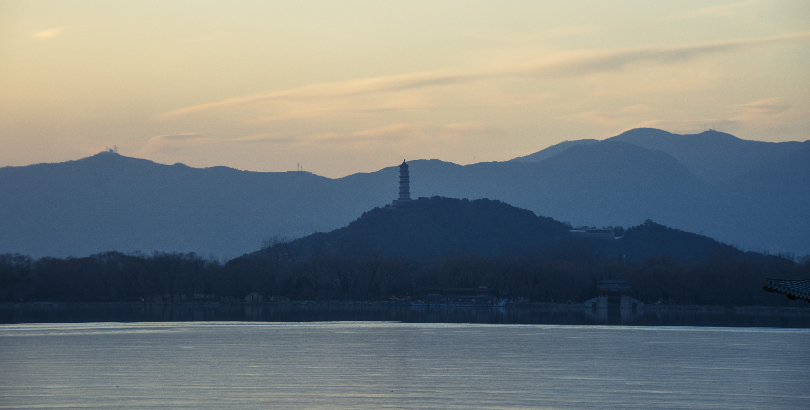
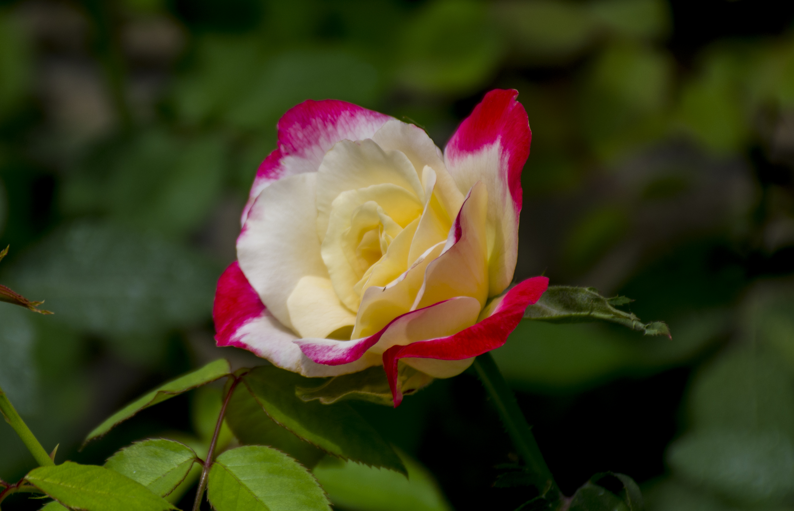

* # 风光

  ## 构图

  ​	在风光摄影中，构图与人像摄影还是有很大的不同的，人像摄影为了强调动感、有趣等人物性格，会故意找构造一些斜线、曲线之类的。风光摄影中，由于有地平线的存在，通常情况下需要将地平线或者相关建筑物的方向要与边缘平行，这样才符合观众对常见风光的认知，在保证平行的同时，也要注意被摄风景在照片中的分布，避免出现左右失衡的状态，平衡的画面可以从视觉上给人以稳定感。

  1. **横构图**：常见于风光拍摄，因为风光中的山川河流一般都是平行的横线条，用于表现开阔宽广的场景，其左右延伸的视觉特性也更接近人眼的观看方式。

     

  2. **竖构图**：给人一种向上延伸的感觉，增强了竖画面向上延伸的表现力和空间感，给观赏者独特的视觉感受。

     

  3. 构图的四个基本元素：

     - **点**：风光摄影中，点可以起到活跃画面的构图效果。合理地运用光线、色彩、对比等方法将画面中的点提炼出来。有点的存在，画面就不会显得单调。

       

     - **线**：线可以为画面带来更多的流动元素，从景色中寻找曲线、射线、斜线等可以表达景色的动感。也可以通过线来对画面进行分割，表达出对比性、层次感等内容（在切分画面时，通常使用三分法，将要重点表达的事物放到三分线的或者三分线的交叉点处）。

       

     - **面**：由不同的线条组合在一起构成的，通常应用在建筑的拍摄上。利用面与面的交错排列，突出被摄主体的形态特征，增强画面立体感。

       

  4. 构图法则：

     - **三分法**：将重点要表达的主体放到三分线的焦点、将分割线放到三分线上，其中要重点表达的主体占据三分之二的画面。

       

     - **水平线**：又称二等分构图，将画面分为两半，常见于拍摄景物及其倒影，表达对称性。

       

     - **三角形**：三角形是最稳定的结构，在摄影构图中，寻找并主动构造三角形，可以使照片给观众一种稳定感。

       

     - **中央构图**：这是一种具有集中力、提高被摄对象存在感的构图方法，被摄主体位于画面的正中央，依靠光影、色彩等手法加以渲染，可以得到具有视觉冲击力、有趣的照片。

       

     - **透视牵引**：利用透视的“近大远小”的规律，利用线条来引导读者的视线到要表达的主体，也可用来对某个大景物的一部分进行特写。

       

     - **框架**：充分利用前景物体作为框架，使画面景物层次丰富，加强画面空间感；另外不同形状的框架也能给画面带来不同类型的装饰，增加画面的形式感。

       

  5. 相关构图元素概念：

     - **主体**：摄影师要表达的主题思想主要通过画面的主体来表现，主体作为画面构图的中心，必须占据在画面的显著位置。如果是一组对象，必须安排好各个对象的关系。
     - **陪体**：主要用于烘托主体，通过对比、引导等方式将读者的焦点引到主体上，切忌“喧宾夺主”。
     - **前景**：位于主体前面靠近镜头的景物。
     - **背景**：在被摄主体背后的一切景物，风光摄影中通常会将背景虚化或者选择纯色等色调简单的景物作为背景这样更容易突出主体。
     - **中景**：通常指的是被拍主体，位于画面前景、背景之间，这样通过前景的遮挡、背景的虚幻来突出中景的主体内容，显得画面有层次感。

  ## 曝光

  风光摄影中为了拍摄出色彩绚丽的照片，一定要掌握好曝光技巧。

  #### 曝光基础 

  曝光主要由三个方面决定的：**光圈、快门、感光度(ISO)**，通过这三个参数的组合，就可以找到适合的曝光值，拍出理想的照片。

  - **光圈**： 控制进光量的大小，类似初中物理课本上讲过的“小孔成像”原理，光圈就类似于那个挡板上的小孔，只不过光圈是大小可变的。光圈越大，景深越小，背景虚化也就越厉害。所以，我们在拍草木鱼虫等特写的时候，通常用大光圈虚化掉背景，重点突出所拍摄物体；在拍摄大的风光景色的时候，为了镜头中尽可能多的物体清晰，通常要选择小光圈。

    

  - **快门**：快门的作用就是通过控制曝光时间的长短来达到控制进光量的效果。快门时间越长，也就是我们说的“慢快门”，进光量也就越多，反之进光量就少。在快门打开的时间内，所有进入到镜头中的光都有累计效果，所以慢快门就有提升亮度的功能，但是副作用就是这期间如果被摄物体位置变了，所拍摄的照片就会出现模糊的情况。但是这种副作用也大大提升了摄影师的创作性，比如利用慢快门创造出一些流光溢彩的“光轨”照片，利用高速快门抓拍运动员拼搏的瞬间等等。

    

    

  - **感光度**：更多的作为上述两种曝光手段的补充，感光度就是指感光元件对光的敏感程度，感光度越高同样强度的光线体现在照片中就是亮度更高，但是噪点也会更多。所以，通常拍摄的时候，尽量通过光圈和快门的组合来调整曝光，如果这两者依然达不到效果，就需要用感光度来辅助了。

  #### 曝光补偿

  相机或手机在拍照的时候，会自动按照已设定的测光模式对目标对象进行测光，并以18%中性灰的反光率作为基准，来决定达到18%中性灰亮度所需要的曝光量，从而得出相应的曝光值。如果画面放光率比18%灰高（即目标对象白色等亮部区域较多），相机系统为了使其接近18%灰，就会自动减少曝光量；反之亦然。单反相机中常见的测光模式有：**点测光、中央区域测光、评价测光**。

  - **点测光**：是指仅以以当前对焦点附近的区域进行测光；通常用于大光比的特写镜头中，保证特写位置曝光准确。
  - **中央重点测光**：是指对整个画面进行测光，并提升中间区域的测光结果的权重，重点保证中央区域测光的准确性；用的较少。
  - **评价测光**：对整个画面进行测光，各个位置测光值的权重一样；通常用于拍摄风光、环境人像等场合。

  曝光补偿是指为了增大（照片变亮）或者减小曝光（照片变暗）数值，而采取的改变相机默认曝光基准值的方式。在调整曝光补偿时，遵循”白加黑减“的原则：如果环境中大片亮度是亮色，就需要增加曝光补偿（避免”死黑“），反之减小曝光补偿（避免过曝）。

  #### 拍摄模式

  其中光圈和快门的曝光方式也对应三种拍摄模式：**光圈优先、快门优先、全手动**

  - **光圈优先**：由用户自己选择光圈的大小，快门根据你的曝光补偿值自动选择。适应于绝大多数场景，例如需要大光圈虚化背景的人像、特写等镜头；
  - **快门优先**：由用户自己选择快门时间长短，光圈根据你的曝光补偿值自动选择。适应于需要表现出光轨、溪流、高速运动瞬间定格。（这种情况下，往往还需要搭配感光度来进一步调整）
  - **全手动**： 光圈、快门都由用户自己选择，此时曝光补偿失效，但感光度依然有效。