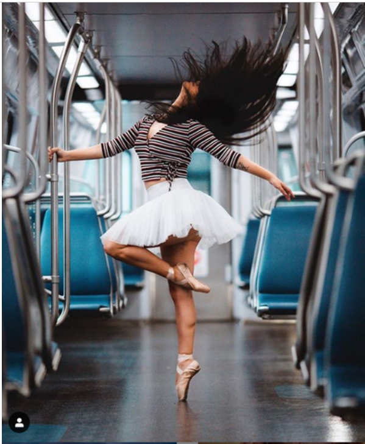

# 人像

## 一、前期功课

1. 模特外形优缺点认识，制定相应的拍摄计划。
2. 熟悉常见的照片风格，找一些喜欢的作品分析拍摄，并找大量同类作品进行分析研究，熟悉此类风格的拍摄以及后期处理技巧。
3. 翻阅一些摄影师访谈以及实际拍摄纪录，学习相关经验教训，三人行必有我师。

## 二、构图

1. **最基本视觉规律：**
   * 全景时的人物、中近景时脸部、特写时眼睛，还有希望突出的人物体态和部位至于三分法的四个交叉点之一。

         
2. **拍摄角度：**
   * **平视**：最常见的角度

     

   * **仰拍**：被拍者肢体会显得细长苗条，主要用于展现模特的身材。（缺点在于会显得脸大）

     

   * **俯拍**：模特的脸会显得更小更尖

     

   * **侧面**：能无限强化动感的角度，有助于展示夸张的动作。

     

   * **背面**：给人带来一种神秘与不可知的感觉。

     
3. **姿态处理**
   * **站姿**：人物全身曲线舒展，容易体现出动作幅度，比较适合下肢修长、身体比例较好的模特。**要点**在于让模特把重心放到一只脚上，头部、胸部、胯部三个面尽量不要平行。尽量设计一些手部动作，丰富画面气氛。

      

   * **坐姿**：强调人物上半身的动作和表情。**要点**在于尽量不要让模特的小腿和手的呼应过于对称，这样会显得死板。

      

   * **躺姿**：用来表现模特轻松惬意的状态，侧躺较为常见，并且两只手的位置务必根据躺姿的角度变化灵活调整，丰富构图。**要点**躺姿不适合骨骼较大身材偏宽的模特使用，容易显得画面紧张局促。

     

   * **蹲姿**：适合可爱但是身材不高的模特，凸显纯真可爱的效果。与坐姿相比，主要是突出了腰部曲线，也会造成画面下半部显得较“重”，上半身略显单薄。要尽可能的找一些道具作为前景，挡住腰部以下位置。

     

   * **动态姿势**：主要是指跑、跳等运动中的姿势，以抓拍为主。**要点**在于需通过各种方式，尽其所能的强化动感：侧面角度、剪影的使用、水平线打破、广角镜头夸张形变等等。

     

## 三、拍摄

1. **与模特沟通**
   * 拍摄前：主动与模特沟通，让她充分了解拍摄意图，同时放松下来。更多时候，可以聊些摄影之外的话题，例如喜欢的电影和音乐，彼此熟悉起来后，拍摄过程中就不会拘谨了。
   * 拍摄中：需要在抓拍中给出一些明确指向性的信息：模特的姿势、表情是否到位、哪些方面可以更好一些等等。一些夸奖性的词要多多使用，例如“不错哦”、“你很棒”之类鼓励的话，都会让模特变得舒心。拍摄一会儿后，可以在休息的时候，让模特回看下之前拍摄的照片，除了活跃气氛，还可以指出哪些可以改进的地方，为后续的拍摄提供参考。**要点**每次的拍摄和动作结束后的几秒钟，才是应该捕捉的时刻，此时的模特处于动作转换的档口，往往有更为自然和精彩的神情流露。永远要比你的模特更早进入拍摄状态，更迟脱离出去，哪怕只有几秒钟的时间——这样才无愧于一个摄影师的称谓，要永远比模特思考的更多，坚持的更久。
2. **自然光线运用**
   * 顺光：让阳光照射模特正面，光线效果清新，自然。**要点**顺光并不意味着作为主光的阳光直射模特的脸，这往往使得模特面部毫无层次，因此必须拉开适当的角度（参考伦勃朗光）；另外，应当尽量选择黄昏和黎明的时候进行拍摄，避免太阳光线直射，光质过硬而不易驾驭。

     

   * 侧光：光从人物的侧面射过来，容易形成强烈的对比明暗效果，使人物轮廓鲜明立体，非常适用塑造人物形体和动作线条。需要时刻注意反差，必要时进行补光。

     

   * 逆光：与顺光相反，阳光直射模特背面，通过调整相机的曝光和角度来产生别样的效果，使模特的表现富有特点和变化。通常情况下，逆光有三种处理形式：1. 对模特脸部进行测光，背景过曝（高调的画面能让读者产生神圣感，日系摄影中常见） 2. 对背景测光，凸显人物形态，并用低角度拍摄模特的剪影。 3. 以太阳光作为轮廓光，对模特正面进行补光。

     

     

   * 侧逆光：介于测光和逆光的之间，外拍中常见的光照方式。将太阳光作为轮廓光，凸显模特的发丝和形体，对模特脸部进行补光（这样的用光方式往往强调模特忧伤、神秘的情绪）。

     

   * _**注意事项**_
     * _顶光和底光时最不适合表现人物的光线，所以拍摄时应该避开这两种光线。中午时分往往是室内拍摄自然光人像的最佳时机，如果确实需要在室外进行拍摄，可以考虑在树荫、屋檐下等没有阳光直射的位置进行拍摄，除了能够柔光之外，还能产生一些有趣的光效。_
     * _大多数闪光灯是在弱光条件下使用的，但是在拍夜景的时候不建议直接使用闪光灯，因为容易产生过大光比，使模特的脸完全脱离环境。实际上，没有细节的环境很难产生价值，往往白天更需要闪光灯的帮助。在白天使用闪光灯，有三个作用：1. 为模特面部补光，摄影师可以在拍摄时通过曝光压暗天空，是背景和天空更有层次感。2. 拍摄大景深人像作品时，可以让我们的光圈收的更小，环境表现更细腻。 3. 制造反光，让闪光灯的光照在水面或者墙面上，产生新的漫射光源，间接补光。（如果觉得闪光灯太硬，可以给他蒙上一层薄纸，产生柔光效果）_
3. **合影拍摄**
   * 带上三脚架，显得重视
   * 使用f11 左右的光圈以及1/100s的快门进行连拍，保证所有人的清楚。
   * 如果合影人数过多，采用中焦段镜头分别拍摄，然后后期合成。当然也可以用广角镜头一次拍完，此时要求站位为弧形，解决广角畸变的问题。
   * 对于出去游玩的创意合影，可以使用如下一些技巧：寻找新奇的角度、利用剪影进行拍摄等等。

