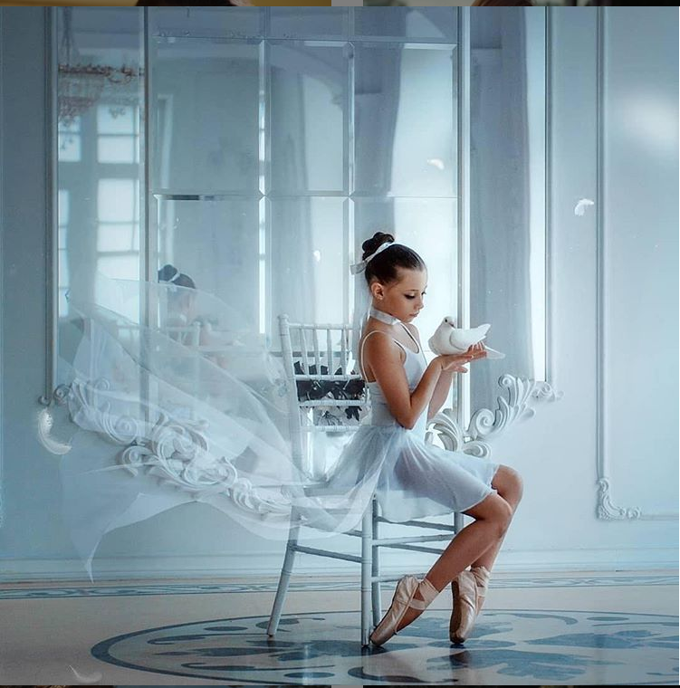
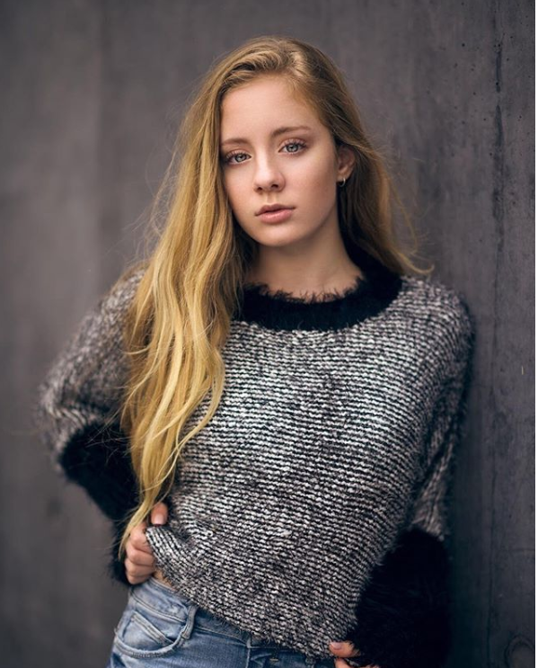
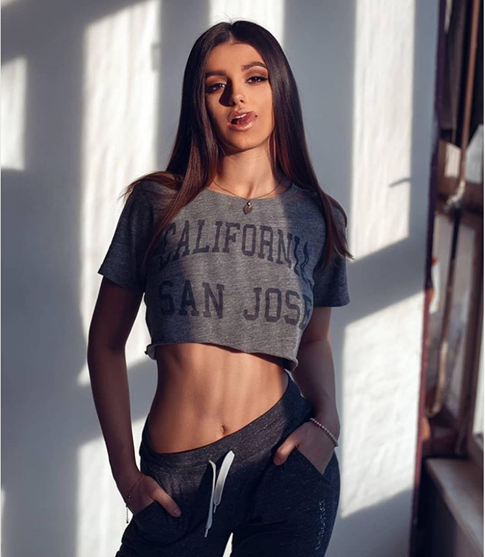
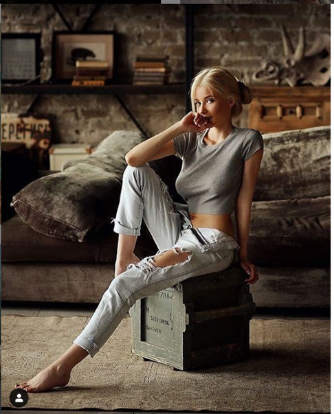
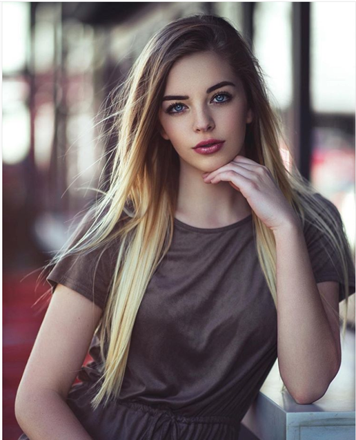
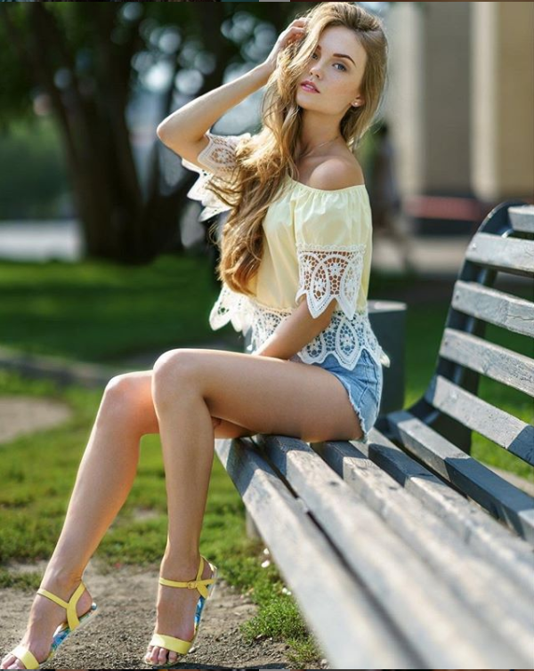
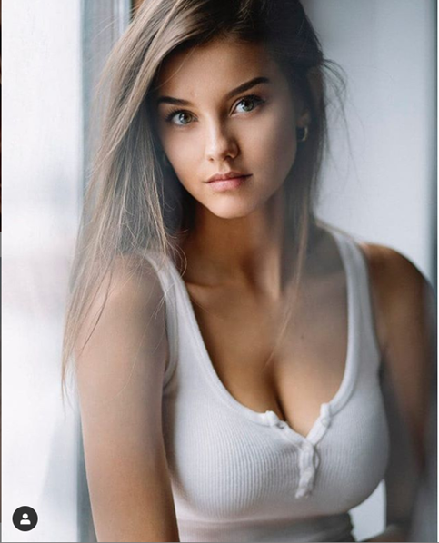
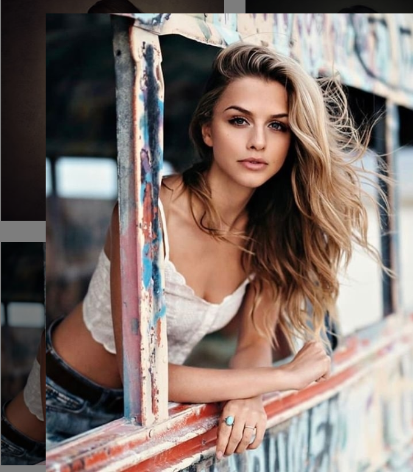
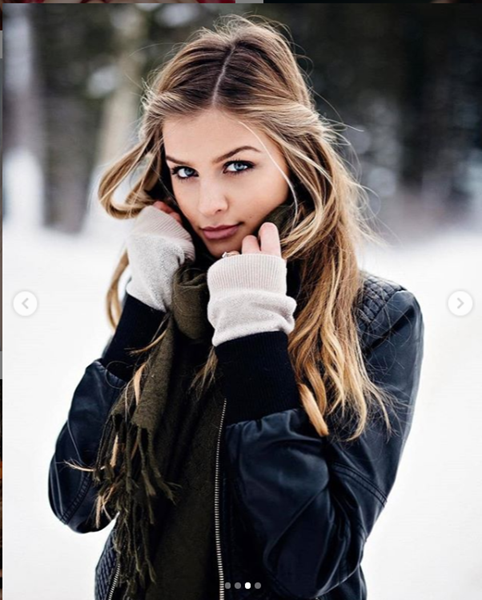
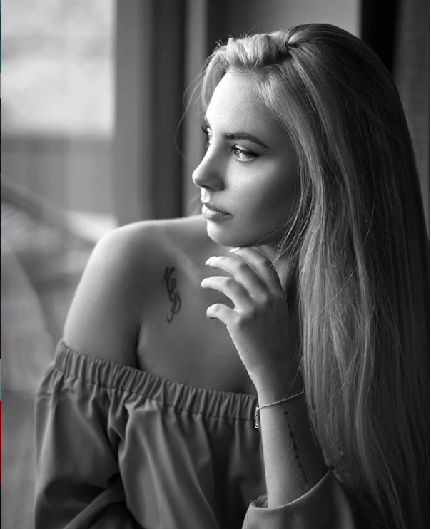

---

---

# 人像摆姿技巧

### 摆姿原理  

1. **避免平行**：人像摄影中，除了证件照要求端端正正的，其余照片尽量不要让头部、肩部、手臂、腰部、腿部等部位与照片的边缘平行，这样会显得略微呆板。将这些隐含的线条变成斜线，整张照片就有了动感，看起来也就有趣多了。当然也要寻找场景中存在的斜线，如窗台、栏杆等。
2. **三角基**：三角形在所有的摄影中都是令人最愉悦和最具动感的形状，因为三角形在照片中总有两条线时倾斜的。为了给构图构造一个三角形的基础，双臂不能垂在身体两侧，而应该使肘部稍微向外突出，使整个手臂显出微微的斜线。当然也可以通过手摸头发、托脸、托下巴等方式构造倒三角。

   1. **坐姿**：模特可以通过将手放到椅子、沙发或者别的东西上，让手臂和身体之间保留一个空间。在摆姿的时候，认真观察，充分利用周围的物件，构建三角形。（注：坐的时候特别是女生，应当坐在椅子或凳子的前端，而椅子或凳子应当与相机有一个角度，一旦坐下，她的重心就应该向前移，坐在座位的边缘比坐在当中优雅许多。让模特脊背挺直，身体前倾，把身体重量挪到大腿上，拍摄的大腿通常比实际要瘦些。重心应当放到离相机较远的那条腿上，这样腿变细了。）

      

   2. **站姿**：可以将手插兜里（一定要将大拇指露出来）或者叉腰（女生），构成一个三角基。还可以通过身体一侧靠墙或者别的物件来让整个身体与墙壁构成一个大的三角基（注意：靠墙的时候身体倾斜，让上半部分和强稍微接触）。

      

      

### 摆姿的基本规则

1. **身体**：模特稍微侧身面对相机（因为正面会显得身体宽厚），一个肩膀应该明显高于另外一个肩膀（双肩的连线不能与地平线平行）。
   1. **四分之三身长肖像**：指的是从头到腰以下的部位（通常是露一半小腿或者大腿。（注：构图中绝对不能将关节处放到照片的边缘）

      

   2. **全身像**：全身像既可以拍站姿也可以拍坐姿，但是一定要记住拍出模特身上的斜线，并构造一个三角基。动感线条——斜线、三角形和其他的不对称形状可以在肖像或群像中引起视觉兴趣，都可以尝试。为了使全身像更好看，身体与相机的角度应当在30-45°之间。

      

2. **手**：绝对不要让模特手指指向相机镜头，这必然会使手变形。应当与相机有个角度。
   1. 只要有可能尽量拍摄手的外侧边缘，这样会使手的线条自然流畅，并能消除从上面或者正面拍摄时产生的变形。
   2. 手腕弯曲可以产生一个不错的曲线。
   3. 尝试着让模特稍稍分开五指，这样可以拍出手指的形状和轮廓（特别适合表现手指的纤细）。
   4. 平展的手没有魅力，向平展的掌心收拢的手指看起来像爪子。一定要让模特手的外侧对着相机，并稍微散开手指，这样手会显得修长、优雅。

   

3. **腿部**： 双脚不要并拢，其中一只脚必须在前，重心放到后面的那条腿上，前腿稍微弯曲，后侧肩膀略低于前侧肩膀（这样身体自然而然地稍微转动就会与相机形成一个角度避免了直面相机）。要让脚指向的方向与相机成一定角度，正面拍摄脚会看起来又短又粗，而让脚与相机成个角度会自动使身体斜对相机。

   

4. **头部**：由于肩膀与相机有个角度，头部需要稍微转动或者倾斜一些，这样眼睛的连线也是倾斜的。

   1. 对于男士来讲，头部常常向肩膀低的一侧倾斜(远离相机的一侧)，头部和身体转向同一方向——光源的方向，让身体和镜头构成45°角。在坐姿的拍摄中，模特身体稍微前倾，这样会显得积极。

   2. 对于女士来讲，头部常常向肩膀高的一侧倾斜(靠近相机的一侧)，身体从腰以上向前倾，面部需要稍稍的向相反的方向微倾。

      

   3. **八分之七视图**：指的是人的目光稍微偏离相机的状态，从取景器里可以看到面部一侧比另一侧稍多，但仍然可以看见离镜头较远的那只耳朵。

      

   4. **三分之二视图**：可以看到两个完整的面颊，离相机远的那只耳朵在相机中看不到，能看到面部的一半比另一半略多。由于相机的透视效果，要求让模特将较小的那只眼离相机近一些。这种视图最能够表现面部的丰满、大小、和表情。

      

   5. **侧面视图**：头转离相机的角度几乎是90度，只能看到一只眼睛。拍摄侧面像时，让模特慢慢转动头部到离相机远的那只眼睛和眉毛从相机里刚好看不到为止。

      
